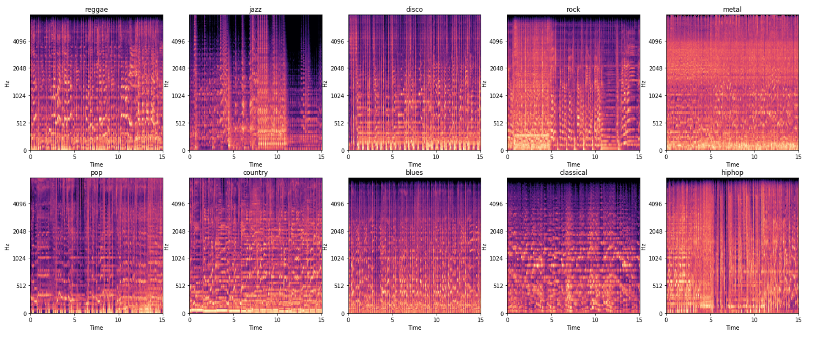

# Musical Genre Classification
**IMPORTANT NOTE:** the data was too large to store on github, so I left it out. If you would like to work off of these notebooks, the data can be found here: http://marsyas.info/downloads/datasets.html. After downloading the data, I combined all of the files into a single folder and named it "wavfiles." For the code to run, this folder must be placed in the empty "data" folder. All of the csv files are also set to be exported to this folder. Happy coding!

## Problem Statement
Music information retrieval (MIR) is a large area of research dedicated to trying to extract useful information from music. Automatic genre classification is one of the tasks motivating this research. An automatic genre classification algorithm could greatly increase efficiency for music databases such as AllMusic. It could also help music recommender systems and playlist generators that companies like Spotify and Pandora use. The goal of this project is to use a convolutional neural network (CNN) to classifty a song by its genre. Specifically, the metric I will be using is accuracy, and I will compare this model to a feed forward neural network (FFNN) for comparisson. CNNs have additional layers for edge detection that make them well suited for image classification problems, but they tend to be more computationally expensive than FFNNs. If a FFNN could perform just as well, there would be no need to use a CNN. 

## Notebooks
1. [Data Gathering](https://github.com/lelandroberts97/Musical_Genre_Classification/blob/master/code/01_Data_Gathering.ipynb)
2. [Data Cleaning](https://github.com/lelandroberts97/Musical_Genre_Classification/blob/master/code/02_Data_Cleaning.ipynb)
3. [Exploratory Data Analysis](https://github.com/lelandroberts97/Musical_Genre_Classification/blob/master/code/03_EDA.ipynb)
4. [Convolutional Neural Network](https://github.com/lelandroberts97/Musical_Genre_Classification/blob/master/code/04_CNN.ipynb)
5. [CNN Exploration](https://github.com/lelandroberts97/Musical_Genre_Classification/blob/master/code/05_CNN_Exploration.ipynb)

## Executive Summary

### Data Gathering
The dataset I used was the GTZAN Genre Collection (linked above) which was used in a well known paper on genre classification in 2002. The format of the files were .wavs, so I was able to use the librosa library to read them into the notebook. 

### Data Preprocessing and Feature Engineering
My initial plan for this project was to use several numeric measures of music, such as mel-frequency cepstrum coefficients, spectral centroid, spectral rolloff, and zero-crossing rate, to use as features. However, after doing some research, I discovered the mel spectrogram, which can be though of as a visual representation of the audio data. Since this was kind of an image of the song bit, I decided instead to train a convolutional neural network, which is well-suited for image classification tasks. This is why there are two different datasets. I kept the numeric feature set because I intend to go back to that and try some more modeling. 

Most of the data preprocessing was done through the use of functions. For the first CNN model, I wrote a function that computed the mel spectrograms for each audio file in a given directory, reshaped them so that they were all the same size, and stored them in a numpy array. It also created an array of corresponding targets, which represented the genre labels. This function returned both the feature array and target array. 

Later on in the process, I decided to try modeling with only a subset of the genres, so I created a function similar to the one mentioned above, but it stored the mel spectrogram data in a dataframe with their correspinding genre labels. In order todo this, I had to flatten the mel spectrograms. This would make it easier to easily access only a subset of the genres for modeling.  

Lastly, for the numeric features, I wrote a function that computed the first 13 mfccs, spectral centroid, spectral rolloff, and zero-crossing rate for each audio file in a given directory. It stored these values in a dataframe as well as their corresponding file names and genre labels. 

### Data Cleaning & EDA
The only data cleaning that had to be done was mapping the genre labels to numeric values. I also graphed one mel spectrogram for each genre to see what they looked like.

### Modeling
I tried several different architectures for both the FFNN and the CNN. The final FFNN achieved a training score (accuracy) of 69% and a testing score of 45%. The final CNN achieved a training score of 84% and a testing score of 68%. As suspected, the CNN did do much better, but it was still overfit. Increasing the number of epochs likely wouldn't help because it became increasingly overfit after about 15 epochs (as did most of the models I tried). 

Here is a summary of the final architecture for the CNN:
1. Input layer: 128 x 660 neurons (128 mel scales and 660 time windows)
2. Convolutional layer: 16 different 3 x 3 filters
3. Max pooling layer: 2 x 4
4. Convolutional layer: 32 different 3 x 3 filters
5. Max pooling layer: 2 x 4
6. Dense layer: 64 neurons
7. Output layer: 10 neurons for the 10 different genres

All of the hidden layers used the RELU activation function and the output layer used the softmax function. The loss was calculated using the categorical crossentropy function. Dropout was also used to prevent overfitting.

To look deeper into what was happening with the model, I computed a confusion matrix to visualize the model's predictions against the actual values. What I found was really interesting!

The computer seems to be confusing some genres for others similarly to how humans would! For example, the model hardly ever predicted blues, and only correctly classified 35% of blues songs, but a majority of the misclassifications were jazz and rock, nearly all the rest of them being classical. This makes a lot of sense! Jazz and blues are very similar styles of music, and rock music was heavily influenced by, and really came out of blues music. Blues also contains a lot of piano, which is characteristic of a lot of classical music.

The model also had a tough time distinguishing between reggae and hiphop. Half of the misclassifications for reggae were hiphop and vise versa. Again, this makes sense since reggae music heavily influenced hiphop music and share similar characteristics. This is pretty cool!

## Conclusions and Future Research
Overall, with an accuracy of 68% for a 10-genre classification task, I can confidently say that the computer was able to learn some distinguishing factors between the different musical genres using a CNN. It did perform better than the FFNN, which means it would be worth using. After diving deeper into the confusion matrix, I found that the computer's mistakes were similar to those a human might make. This gives me even more confidence that the computer was actually learning the genres to at least some extent. A natural next step would be to identify outliers or try running the model on a subset of the genres. 

In the CNN exploration notebook, I did start messing around with genres subsets. The most interesting finding so far was that removing blues, rock, and reggae (three features the algorithm commonly got confused for other genres) increased the testing accuracy to 81%. Of course, baseline accuracy went from 10% to 14$, but this is still a decent improvement. I plan on exploring this further. 

In addition to exploring modeling with subsets of the genres, I would also like to try modeling with numeric features, and maybe even finding a way to combine the two (if that's possible). More data would be helpful as well, so I would like to research other datasets to use. 

## Limitations
One of the biggest limitations of this project was the size of the dataset. 100 songs per genre is a pretty small sample size for a model to be training on. In addition, genres are defined by humans. Most genres have very loose definitions -- so much so that humans argue about which genre a particular song is. Even so, more data should help. 